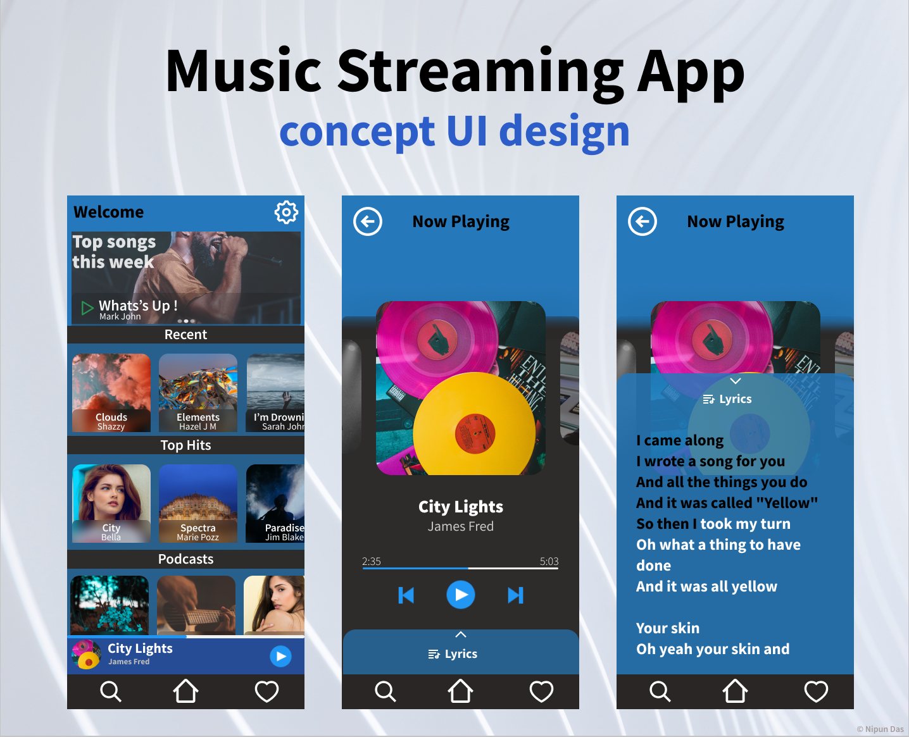
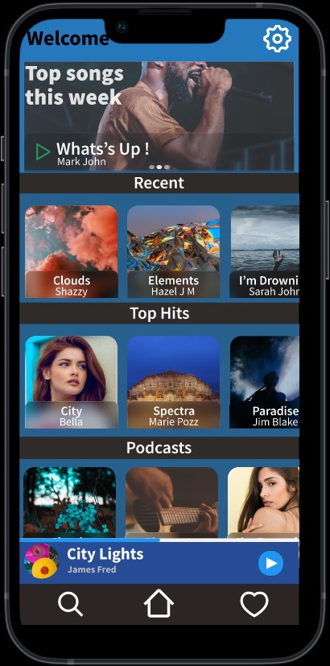

# Music-Streaming-App-UI

- This is the first project that I created using Figma for practicing. 
- An Elegant UI concept for a Music Streaming App. 
- Ps. I recreated some parts of Spotify.

  
## Screenshot

  &nbsp;&nbsp;&nbsp;&nbsp;&nbsp;&nbsp;&nbsp;&nbsp;&nbsp;
  &nbsp;&nbsp;&nbsp;&nbsp;&nbsp;&nbsp;&nbsp;&nbsp;&nbsp;
  

  
- You can view the project in Figma here : https://www.figma.com/file/8t7oc6pIpt6DHXSBb0Wmcd/Music-Player-App?node-id=0%3A1 

